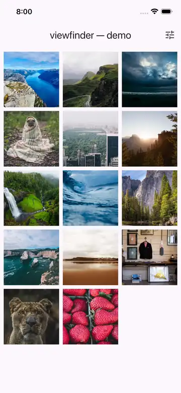

# viewfinder

[](https://codecov.io/gh/koji-1009/viewfinder)

A photo viewer for Flutter. Pinch / double-tap / rotation zoom, an arena-aware gesture layer that hands off edge pans to a parent `PageView`, drag-to-dismiss, a synchronized thumbnail strip, a page indicator, keyboard shortcuts, and a chrome controller for tap-to-toggle UX.

Accepts any `ImageProvider` (`NetworkImage`, `AssetImage`, `FileImage`, `MemoryImage`, …) and feeds it straight to `Image()`. No runtime dependencies beyond the Flutter SDK.


<p align="center">
  
  &nbsp;&nbsp;
  
</p>

## Highlights

* **Native-feel gestures** — pinch, pan, fling on translation and scale, double-tap ladder, double-tap-and-drag continuous zoom (iOS Photos style), opt-in two-finger rotation, rubber-band over-pan with snap-back on release.
* **Built for every input** — touch, stylus, trackpad, mouse, mouse wheel, hardware keyboard. Mouse-drag swipes pages on web and desktop out of the box.
* **Plays well with parents** — an arena-aware gesture layer hands edge pans back to a parent `PageView` so a zoomed photo can swipe to the next page without lifting the finger, on either axis.
* **Gallery affordances included** — `Viewfinder.images([...])` covers the common case; thumbnail strip (4 positions or fully custom), page indicator (dots / label / adaptive), drag-to-dismiss, tap-to-toggle chrome controller. All opt-in.
* **Robust pop / back-button** — pop while zoomed snaps every page back to its initial transform first, so any Hero flight starts from a sensible source rect; the first back / Esc on a zoomed photo resets the zoom, the second pops.
* **No runtime dependencies** beyond the Flutter SDK.

## Quick start

### Gallery from a list

```dart
Viewfinder.images(
  photos, // List<ImageProvider>
  dismiss: ViewfinderDismiss(onDismiss: () => Navigator.pop(context)),
)
```

### Single photo, full-screen

```dart
Viewfinder.single(
  image: const NetworkImage('https://example.com/photo.jpg'),
  dismiss: ViewfinderDismiss(onDismiss: () => Navigator.pop(context)),
  maxScale: 10,
)
```

### Custom per-page (gallery builder)

```dart
Viewfinder(
  itemCount: photos.length,
  precacheAdjacent: 2,
  thumbnails: const ViewfinderThumbnails(size: 64),
  indicator: const ViewfinderPageIndicatorAdaptive(),
  dismiss: ViewfinderDismiss(onDismiss: () => Navigator.pop(context)),
  itemBuilder: (context, index) => ViewfinderItem(
    image: photos[index],
    thumbImage: photosLowRes[index], // optional progressive load
    semanticLabel: 'Vacation photo ${index + 1}',
  ),
)
```

### Embedded zoomable image

For a single zoomable image _inside_ another scrollable layout (no chrome, no dismiss), use `ViewfinderImage` directly:

```dart
ViewfinderImage(
  image: const NetworkImage('https://example.com/photo.jpg'),
  initialScale: const ViewfinderInitialScale.contain(),
  doubleTapScales: const [1, 2.5, 5],
  maxScale: 8.0,
)
```

For non-image content, `ViewfinderImage.child(child: …)` zooms any widget.

## Initial scale

Three flavors, each accepting an optional multiplier:

```dart
const ViewfinderInitialScale.contain()      // fit-in-viewport (default)
const ViewfinderInitialScale.contain(0.8)   // 80% of fit, leaves margin
const ViewfinderInitialScale.cover()        // fill-viewport, crop overflow
const ViewfinderInitialScale.cover(1.2)     // 120% of fill
const ViewfinderInitialScale.value(2.0)     // absolute 2× over `contain`
```

## Zoom & pan

Knobs on `ViewfinderImage` that control how a single image responds to gestures. `Viewfinder` forwards the same knobs (`defaultInitialScale` / `minScale` / `maxScale` / `doubleTapScales` / `rotateEnabled` / `rubberBandPan` / `interactionEndFrictionCoefficient`) to every page.

| Knob                                | Default                       | What it does                                                                                                                                 |
| ----------------------------------- | ----------------------------- | -------------------------------------------------------------------------------------------------------------------------------------------- |
| `minScale` / `maxScale`             | `1.0` / `8.0`                 | Hard zoom bounds. Pinch past either is rubber-banded toward the limit.                                                                       |
| `doubleTapScales`                   | `[1.0, 2.5, 5.0]`             | Cycle through these on each double-tap. Pass `[]` to disable double-tap zoom.                                                                |
| `rubberBandPan`                     | `true`                        | When zoomed and panned past an edge, the displacement diminishes elastically and snaps back on release. Pass `false` for hard edge clamping. |
| `rotateEnabled`                     | `false`                       | Two-finger rotation. Off by default because Flutter's `ScaleGestureRecognizer` reports rotation only when explicitly enabled.                |
| `interactionEndFrictionCoefficient` | `kViewfinderDefaultFlingDrag` | Friction for post-release fling on translation and scale. Lower = longer glide. Defaults to `0.0000135`.                                     |
| `panEnabled` / `scaleEnabled`       | `true` / `true`               | Disable pan or scale individually. Useful for embedded read-only zoom.                                                                       |
| `onScaleStart` / `onScaleEnd`       | —                             | Gesture lifecycle callbacks. Useful for haptics and analytics.                                                                               |
| `onScaleChanged`                    | —                             | Fires on every scale update with the current state.                                                                                          |
| `onTap` / `onTapUp` / `onTapDown`   | —                             | Tap callbacks; `onTap` waits for double-tap disambiguation.                                                                                  |

## Gallery & paging

Knobs on `Viewfinder` that control how pages flow.

| Knob                      | Default                              | What it does                                                                                                                                                        |
| ------------------------- | ------------------------------------ | ------------------------------------------------------------------------------------------------------------------------------------------------------------------- |
| `pagerAxis`               | `Axis.horizontal`                    | Page direction. Vertical galleries also work, with the edge-handoff axis flipped accordingly.                                                                       |
| `reverse`                 | `false`                              | Forwarded to `PageView.reverse`. Use `true` for right-to-left galleries.                                                                                            |
| `pageSpacing`             | `0`                                  | Pixels between pages.                                                                                                                                               |
| `precacheAdjacent`        | `1`                                  | Warm the `imageCache` for ±N pages around the current one. Uses the user's `ImageProvider` directly, so cache keys match what `Image()` will resolve at paint time. |
| `allowEdgeHandoff`        | `true`                               | When zoomed and panned to the edge, yields to the parent `PageView` so the user can swipe to the next page without lifting. `false` clamps inside the current page. |
| `swipeDragDevices`        | `kViewfinderDefaultSwipeDragDevices` | Pointer kinds allowed to swipe the underlying `PageView`. Default includes mouse / trackpad / touch / stylus. Pass a narrower set to opt out.                       |
| `enableKeyboardShortcuts` | `true`                               | Arrow Left/Right, PageUp/Down, Esc (two-stage). Disable to take over the keyboard.                                                                                  |
| `allowImplicitScrolling`  | `true`                               | Forwarded to `PageView.allowImplicitScrolling` for accessible focus traversal.                                                                                      |

## Image loading

| Knob                                    | Default    | What it does                                                                                         |
| --------------------------------------- | ---------- | ---------------------------------------------------------------------------------------------------- |
| `thumbImage` / `thumbCrossFadeDuration` | — / 200 ms | Low-res preview that cross-fades into the main image once the first frame lands.                     |
| `gaplessPlayback`                       | `true`     | Forwarded to `Image.gaplessPlayback`. Keeps the previous frame visible while a new provider decodes. |
| `loadingBuilder` / `errorBuilder`       | —          | Forwarded straight to `Image()`.                                                                     |
| `filterQuality`                         | `medium`   | Image filter quality.                                                                                |

## Drag-to-dismiss

`ViewfinderDismiss(onDismiss: …)`. Auto-disabled while zoomed. Background fades with drag.

| Knob             | Default      | What it does                                                                                     |
| ---------------- | ------------ | ------------------------------------------------------------------------------------------------ |
| `direction`      | `.vertical`  | `.vertical` accepts both, or restrict to `.up` / `.down`.                                        |
| `threshold`      | `0.25`       | Fraction of viewport height past which release triggers dismissal.                               |
| `slideType`      | `.wholePage` | `wholePage` slides thumbnails too; `onlyImage` keeps thumbnails / indicator / overlays anchored. |
| `fadeBackground` | `true`       | Fade the background color in step with the drag.                                                 |
| `onProgress`     | —            | Reports normalized drag progress (incl. spring-back). Useful for fading external chrome in sync. |

## Page indicator

Sealed `ViewfinderPageIndicator`, three variants:

* `ViewfinderPageIndicatorDots` — one dot per page.
* `ViewfinderPageIndicatorLabel` — single text label, default `"i / N"`. Pass `labelBuilder` for full control.
* `ViewfinderPageIndicatorAdaptive` — dots up to `maxDots`, then falls back to the label. The most common pick.

## Inputs

* **Touch / stylus / trackpad / mouse** — wired by default.
* **Mouse wheel** — zooms around the pointer location.
* **Trackpad pinch (macOS)** — wired in.
* **Mouse drag on web/desktop** — swipes pages out of the box (`swipeDragDevices` includes mouse).
* **Hardware keyboard** — Arrow Left/Right, PageUp/Down, Escape. Escape and Android back are two-stage: first press resets zoom on a zoomed photo, second press pops / dismisses.

## Imperative control

### `ViewfinderController` — page navigation

```dart
final controller = ViewfinderController(initialIndex: 0);

controller.jumpTo(3);
controller.animateTo(3);
controller.currentIndex;          // int
controller.resetCurrentImage();   // returns true if a zoom was reset
```

`resetCurrentImage()` is the hook for two-stage back behavior — call it before your own `Navigator.pop` to reset zoom on the first press and pop on the second.

### `ViewfinderImageController` — per-image transform

```dart
final controller = ViewfinderImageController();

// Zoom.
controller.animateToScale(3.0);
controller.animateToScale(2.0, focal: tapPosition);
controller.reset();

// Direct matrix control.
final m = controller.currentTransform;
controller.jumpToTransform(m..translate(20.0, 0.0));
controller.animateToTransform(targetMatrix);

// Edge-state introspection.
controller.canSwipeHorizontally; // bool
controller.canSwipeVertically;   // bool
controller.scaleState;           // ViewfinderScaleState
```

### `ViewfinderChromeController` — chrome visibility

```dart
final chrome = ViewfinderChromeController(
  autoHideAfter: const Duration(seconds: 3),
  autoHideWhileZoomed: true,
);

Viewfinder(
  chromeController: chrome,
  thumbnails: const ViewfinderThumbnails(),
  indicator: const ViewfinderPageIndicatorAdaptive(),
  chromeOverlays: [
    Positioned(top: 0, left: 0, right: 0, child: myAppBar),
  ],
  // …
)
```

Tap the photo: toggle. Zoom in: auto-hide. Page change: auto-hide timer restarts. `chromeOverlays` fade in sync with thumbnails and indicator.

## Hero

`ViewfinderHero` forwards every option Flutter's `Hero` exposes (`createRectTween`, `flightShuttleBuilder`, `placeholderBuilder`, `transitionOnUserGestures`). Two known Hero-with-photo-viewer pitfalls are handled internally:

* **Source rect coherence on pop** — when the route pops while a page is zoomed in, every page jumps back to its initial transform _before_ the Hero flight captures its source rect. The flight starts from the photo's natural bounds, never from a visibly zoomed crop.
* **Adjacent-page Hero leak** — only the currently-visible page carries its Hero tag. `PageView` pre-builds neighbors (especially with `allowImplicitScrolling`); without this rule, every pre-built page would fly on pop.

These together let the back button stay two-stage by design: the first press on a zoomed photo resets the zoom; the second pops. If you drive navigation yourself, check the reset status first:

```dart
if (galleryController.resetCurrentImage()) return; // zoom was reset
Navigator.of(context).pop();
```

Hero flights look cleanest when the destination route doesn't itself animate horizontally; the photo's flight has to compete with the sliding page otherwise.

| Route                                                 | Hero advice                                                                                                                                                                                                   |
| ----------------------------------------------------- | ------------------------------------------------------------------------------------------------------------------------------------------------------------------------------------------------------------- |
| `MaterialPageRoute` (Android fade-up)                 | Hero is fine — destination stays roughly centered while it fades in.                                                                                                                                          |
| `CupertinoPageRoute` (right-to-left slide)            | Skip Hero. The slide already animates the destination horizontally for the entire transition; adding a Hero on top fights with it. Pass `hero: null` to `ViewfinderItem` and don't wrap the source thumbnail. |
| Custom `PageRouteBuilder` with a fade-only transition | Hero is the main motion. iOS Photos uses this — the route transition is just background chrome fading, the photo's flight does the rest.                                                                      |

Custom flight options work the same as Flutter's `Hero`:

```dart
ViewfinderItem(
  image: photo,
  hero: ViewfinderHero(
    'photo-1',
    createRectTween: (begin, end) => MaterialRectArcTween(begin: begin, end: end),
    flightShuttleBuilder: (ctx, anim, dir, fromCtx, toCtx) => toCtx.widget,
    transitionOnUserGestures: true,
  ),
)
```

## Decode size and memory

The library does **not** wrap your `ImageProvider` with `ResizeImage`. The provider you pass is the provider that decodes — at the source's native resolution. For a zoom-capable photo viewer that's usually what you want, because zoom past 1× immediately runs out of pixels otherwise.

If memory matters more than zoom quality, wrap on your side:

```dart
ViewfinderItem(
  image: ResizeImage(
    NetworkImage(url),
    width: targetPx,
    height: targetPx,
  ),
)
```

For thumbnail-style usage at small sizes, multiply your logical pixel size by `MediaQuery.devicePixelRatioOf(context)` — `ResizeImage.width` / `.height` are interpreted as physical pixels in current Flutter.

## Network images: pair with a byte-caching provider

`NetworkImage` has no persistent HTTP cache. Each distinct `ImageProvider` cache key triggers a fresh HTTP GET on remount.

Pair viewfinder with an `ImageProvider` that caches bytes on disk so a single HTTP fetch serves every later decode — for example [`taro`](https://pub.dev/packages/taro):

```dart
ViewfinderItem(
  image: TaroImage('https://example.com/photo.jpg'),
)
```

The provider must be a pure `ImageProvider` that delegates to the `ImageDecoderCallback` passed to `loadImage`, so any `ResizeImage` you put on top of it can still flow `getTargetSize` through to the codec.

The layers compose cleanly:

| Layer         | Job                          | Provided by                  |
| ------------- | ---------------------------- | ---------------------------- |
| Decode size   | Decode at the requested size | your `ResizeImage` (or none) |
| Decoded frame | Reuse across same cache key  | Flutter `imageCache`         |
| Bytes / HTTP  | Reuse across decode sizes    | your byte-caching provider   |

## License

MIT.
